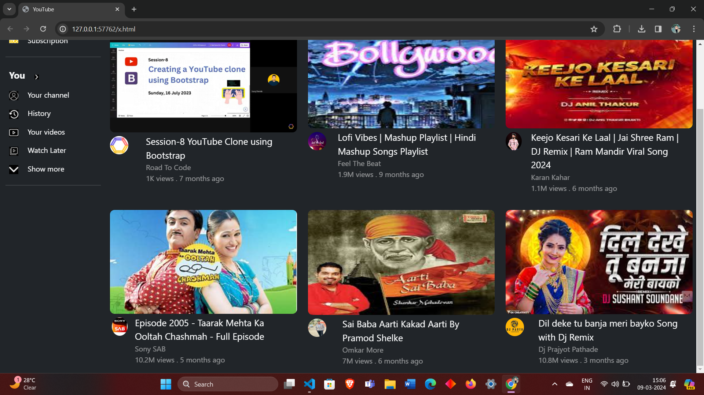

# YouTube Website

## Overview

This project is a simple YouTube website that allows users to watch and upload videos.

## Features

- *Video Playback:* Watch your favorite videos with a seamless playback experience.
- *Upload Videos:* Share your content by uploading videos to the platform.
- *User Profiles:* Customize your profile and keep track of your uploaded videos.

## Installation

1. Clone this repository: git clone https://github.com/OmkarMore01/yt-clone
2. Navigate to the project directory: cd youtube-website
3. Open index.html in your preferred web browser.

## Usage

1. Browse through the available videos on the homepage.
2. Click on a video thumbnail to watch it.
3. To upload a video, navigate to the "Upload" section and follow the instructions.
